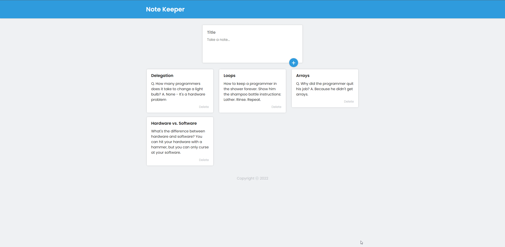

## Note Keeper

This project is a React note keeper app inspired by Google Keep. It uses local storage to store and manage notes, showcasing my ability to create functional and responsive applications.

[Demo Here](https://feliperdamaceno.github.io/note-keeper)

## Licence

This is an open-source project and is available under the [**MIT License**](LICENSE). You are free to use, modify, and distribute the code in accordance with the terms of the license.

## Contributors

Contributions are highly appreciated! If you encounter any issues or have suggestions for improvements, please feel free to open an issue or submit a pull request.

[feliperdamaceno](https://github.com/feliperdamaceno)

## Contact me

Linkedin: [feliperdamaceno](https://www.linkedin.com/in/feliperdamaceno)
